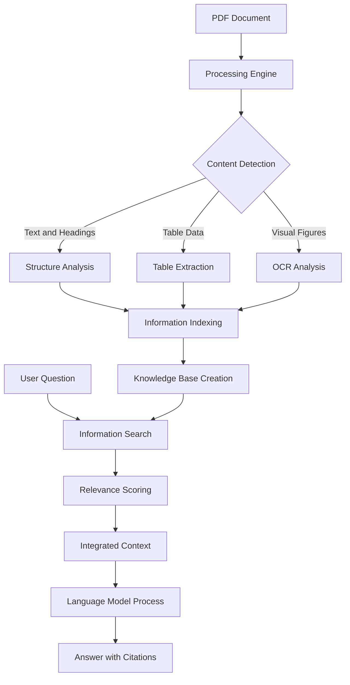

# MultiModal RAG
A high-performance Retrieval-Augmented Generation (RAG) system specialized for deep document intelligence. This system transforms static PDF files into structured knowledge by analyzing document layouts, extracting complex tables, and using vision-based OCR to ensure the AI has the complete context for every answer.
## System Workflow

The following diagram illustrates how a document moves through the system, from initial upload to the final answer.



## Core Processes

### Document Extraction

The system uses multiple methods to ensure no information is lost:

- **Structural Detection**: Uses font properties to distinguish between headings and paragraphs, preserving the document's logical flow.
- **Table Processing**: Identifies rows and columns to convert tables into formatted data that can be analyzed logically.
- **Visual Analysis**: Extracts images and figures, then uses Optical Character Recognition (OCR) to read any text contained within them.

### Information Search and Retrieval

The system uses a two-step process to find answers:

1. **Initial Search**: Converts your question and the document sections into mathematical values (embeddings). It quickly finds the sections that are most similar to your question.
2. **Relevance Ranking**: Takes the best sections from the initial search and performs a second, more precise check to ensure the information directly addresses your request.

### Alternative Model Options

Although this system is configured to use the Groq API for maximum speed by default, it is designed with flexibility in mind. You can adapt the code to run entirely on your own hardware using alternatives such as:

- **Ollama**: Connect to locally hosted models (like Llama 3 or Mistral) for 100% private processing without an API key.
- **Local Open-Source Models**: Use libraries like `transformers` or `llama-cpp-python` to run language models directly on your GPU or CPU.
- **Custom Inference Servers**: Any OpenAI-compatible API endpoint can be swapped in for the generation stage.

## Folder and Output Structure

When a document is processed, the system organizes the data into the following structure:

```text
Exp4/
├── app.py              <-- Web interface entry point
├── pdf_parser/         <-- Logic for reading PDFs
├── rag/                <-- Logic for search and answering
├── output/             <-- Processed data folder
│   ├── images/         <-- Images and figures found in the PDF
│   └── document.json   <-- The structured content of the PDF
└── data/               <-- Your input PDF files
```

### The Structured Data Format

The system creates a JSON file in the `output` folder that represents the PDF's content. Here is a sample of how the data is stored:

```json
{
  "type": "table",
  "text": "| Subfield | Papers | Growth |",
  "page_number": 2,
  "section_heading": "3. Results",
  "tables": [
    ["Subfield", "Papers", "Growth"],
    ["AI", "187", "340%"]
  ]
}
```

This format allows the system to know exactly what the content is (type), where it is located (page), and which topic it belongs to (section).

## Setup Instructions

### 1. Requirements

- **Python 3.9 or newer**
- **Tesseract OCR**: Required for extracting text from images.
- **Groq API Key**: For fast response generation.

### 2. Installation

```bash
# Clone the repository
git clone https://github.com/emanalytic/RAG-Chatbot.git
cd RAG-Chatbot

# Setup environment
python -m venv .venv
source .venv/bin/activate  # Windows: .venv\Scripts\activate
pip install -r requirements.txt
```

### 3. Model Download

The system requires specific search models to be downloaded to your local machine:

```bash
python scripts/download_models.py
```

### 4. API Configuration

Create a `.env` file in the main folder and add your key:

```text
GROQ_API_KEY=your_key_here
```

## Usage

### Web Application

Launch the interactive dashboard:

```bash
streamlit run app.py
```

### Testing the Processor

To test the extraction on a specific file without the web interface:

```bash
python main.py path/to/your/document.pdf
```

After running this, you can inspect the `output` folder to see the generated data.
